# REST & gRPC Service Contracts

An Order Service calls an Inventory Service to check whether an item and quantity are available. The same interaction is implemented twice, once with REST/HTTP (JSON) and once with gRPC (Protocol Buffers), including timeout and deadline handling.

## Project structure

```
.
├── README.md
├── requirements.txt
├── rest/
│   ├── inventory_service.py
│   └── order_service.py
├── grpc_version/
│   ├── inventory.proto
│   ├── inventory_pb2.py            (generated)
│   ├── inventory_pb2_grpc.py       (generated)
│   ├── inventory_server.py
│   ├── order_service.py
│   └── grpc_client.py
└── evidence/                       (screenshots and logs)
```

## Setup

```bash
python3 -m venv venv
source venv/bin/activate
pip install -r requirements.txt
```

Sample stock: `apple: 10`, `banana: 0`, `laptop: 3`.

| Service | Port |
|---|---|
| REST Inventory | 5001 |
| REST Order | 5003 |
| gRPC Inventory | 50052 |
| gRPC Order | 5002 |

Notes: the REST Order Service uses port 5003 because macOS AirPlay Receiver occupies 5000. The gRPC Inventory Service uses 50052 because 50051 was already bound by macOS `launchd` on my machine.

Timeout / deadline is **2 seconds**. The Inventory services can be slowed with the `INVENTORY_DELAY_SECONDS` environment variable (default 0). The demo uses 5 seconds.

## Running the REST version

Open three terminals, each with the venv activated, from the repo root.

```bash
# Terminal 1: Inventory
python rest/inventory_service.py

# Terminal 2: Order
python rest/order_service.py

# Terminal 3: send an order
curl -i -X POST localhost:5003/orders -H "Content-Type: application/json" -d '{"item_id":"apple","quantity":2}'
```

## Running the gRPC version

The `.proto` stubs are already generated and committed. To regenerate them:

```bash
cd grpc_version
python -m grpc_tools.protoc -I. --python_out=. --grpc_python_out=. inventory.proto
```

Then, with three terminals (services must be started from inside `grpc_version`):

```bash
# Terminal 1: Inventory
cd grpc_version
python inventory_server.py

# Terminal 2: Order
cd grpc_version
python order_service.py

# Terminal 3 (repo root): send an order
curl -i -X POST localhost:5002/orders -H "Content-Type: application/json" -d '{"item_id":"apple","quantity":2}'
```

## Successful REST example

Request:

```bash
curl -i -X POST localhost:5003/orders -H "Content-Type: application/json" -d '{"item_id":"apple","quantity":2}'
```

Response:

```
HTTP/1.1 201 CREATED
Content-Type: application/json

{"inventory":{"available":true,"in_stock":10,"item_id":"apple","requested":2},"order_status":"accepted"}
```

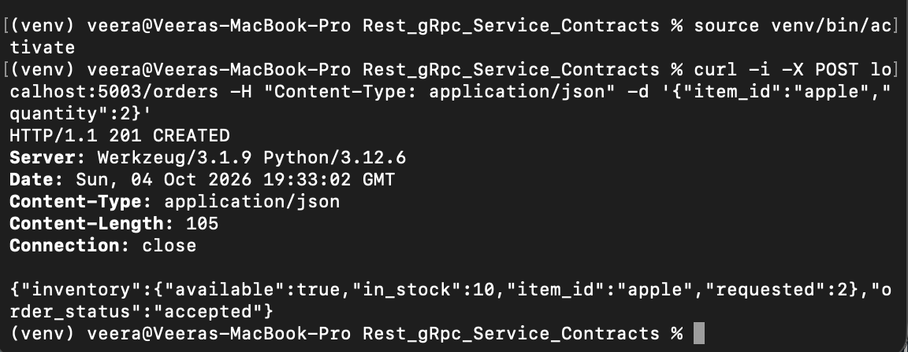

## Successful gRPC example

Direct gRPC call to the Inventory Service (`python grpc_client.py apple 2`):

```
REQUEST:
item_id: "apple"
quantity: 2

RESPONSE:
item_id: "apple"
requested: 2
in_stock: 10
available: true

STATUS: OK
```


Through the Order Service (HTTP in front, gRPC behind):

```
HTTP/1.1 201 CREATED

{"in_stock":10,"item_id":"apple","order_status":"accepted","requested":2}
```

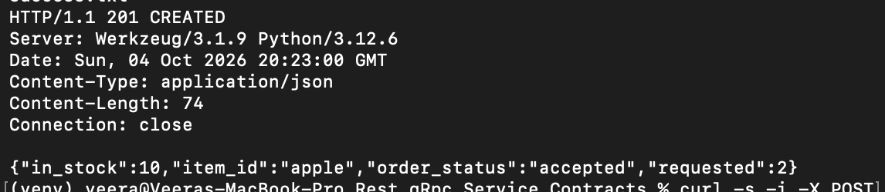

## Unavailable item handling

| Situation | REST | gRPC |
|---|---|---|
| In stock | 200 (Inventory) / 201 (Order) | OK |
| Bad input | 400 | Rejected by the Order Service with 400 before the gRPC call |
| Unknown item | 404 | NOT_FOUND |
| Not enough stock | 409 | FAILED_PRECONDITION |
| Too slow | client timeout (504 from Order) | DEADLINE_EXCEEDED (504 from Order) |

REST, not enough stock (409):

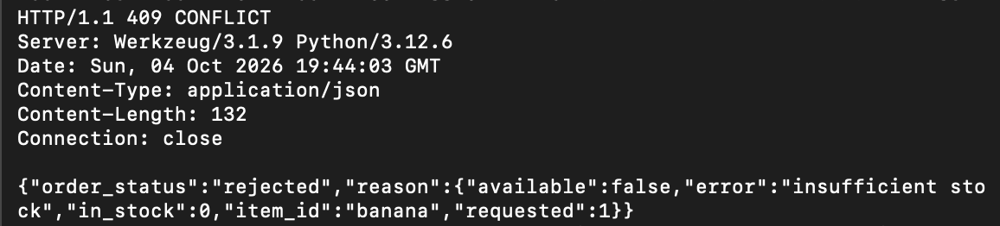

gRPC, unavailable item (`python grpc_client.py banana 1`):

```
STATUS: FAILED_PRECONDITION
DETAILS: insufficient stock
```

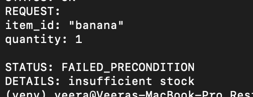

gRPC through the Order Service (FAILED_PRECONDITION mapped to HTTP 409):

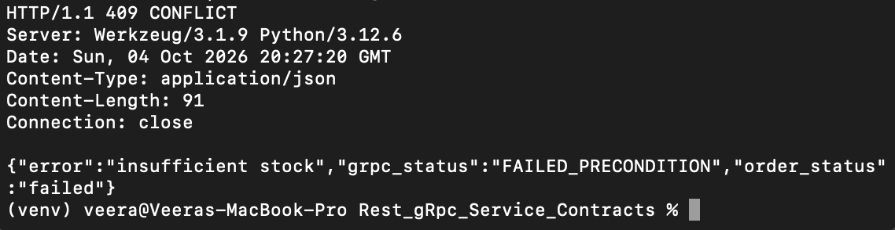

## REST timeout handling

Inventory restarted with a 5-second delay (`INVENTORY_DELAY_SECONDS=5 python rest/inventory_service.py`), while the Order Service kept running with a 2-second timeout.

```
HTTP/1.1 504 GATEWAY TIMEOUT

{"error":"inventory service timed out","order_status":"failed"}
```

Elapsed time: **2.041 s** (not 5 s), so the timeout fired.

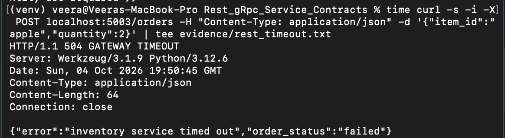

Order Service log:

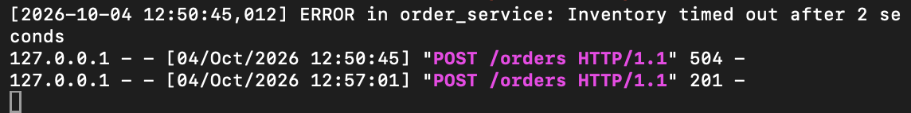

## gRPC deadline handling

Inventory restarted with a 5-second delay (`INVENTORY_DELAY_SECONDS=5 python inventory_server.py`), while the Order Service kept running with a 2-second deadline.

```
HTTP/1.1 504 GATEWAY TIMEOUT

{"error":"Deadline Exceeded","grpc_status":"DEADLINE_EXCEEDED","order_status":"failed"}
```

Elapsed time: **2.038 s** (not 5 s), so the deadline fired.

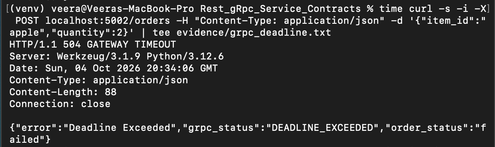

Order Service log:

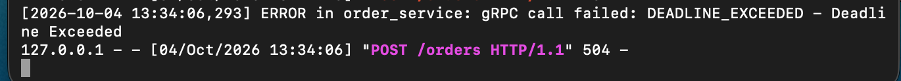

## Order Service stays running after failures

After each failure, Inventory was restarted without the delay and a valid order was sent to the **same Order Service process, which was never restarted**. It returned `201 CREATED`.

REST (504 followed by 201):

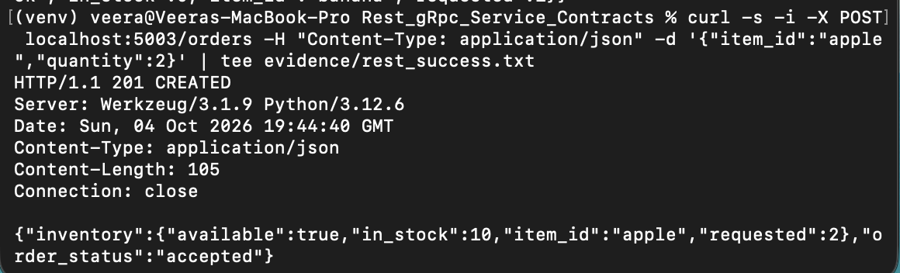

gRPC (504 followed by 201):

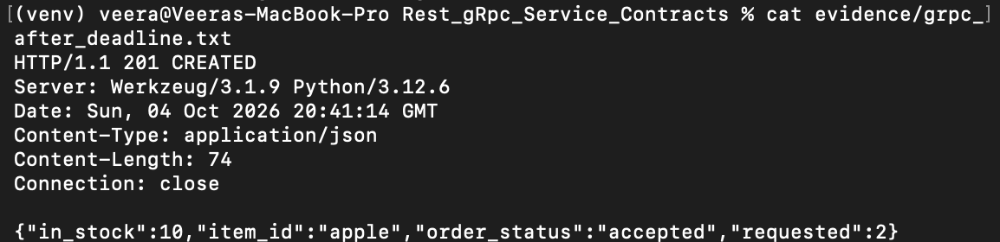

gRPC Order Service log after the failure:

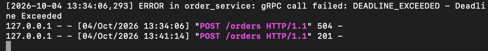

## REST vs. gRPC comparison

REST was easier to start with, because I only wrote Flask code and tested it with curl, but gRPC needed a `.proto` file and generated stubs first. In REST the contract was only inside my code, while in gRPC the `.proto` file clearly defined the request and response for both services. The timeout in REST was a `timeout=2` setting on the client, but in gRPC the deadline was part of the call and came back as its own `DEADLINE_EXCEEDED` status. Overall, REST felt simpler and faster to test, while gRPC felt stricter and cleaner for a contract between two services, even though I had to move both services to different ports (5003 and 50052) because macOS was already using the default ones.
